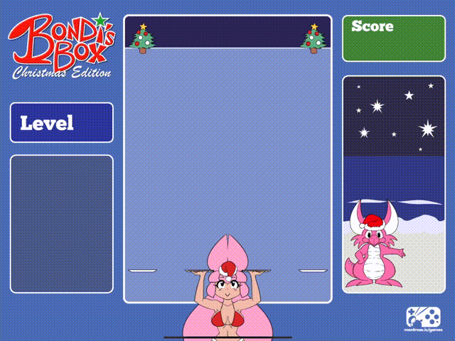

# Bondi's Box: Christmas Edition
This is the parenscript source for "Bondi's Box: Christmas  Edition", an HTML5 falling/stacking puzzle 

[Play Here](https://www.newgrounds.com/portal/view/826949)

## Building

HTML can be compiled in an Emacs SLIME image (C-c C-k) once the parenscript environment has been defined (by running lines 1-11 or their equivalent interactively). Remember to change the output file path, `"/Users/bondi/Downloads/foolin/joy/index.html"` to someplace sensible.

## Art & Music

Art and music is not required to build and are copywritten and licensed separately. See the [Newgrounds page](https://www.newgrounds.com/portal/view/826949) for details.

